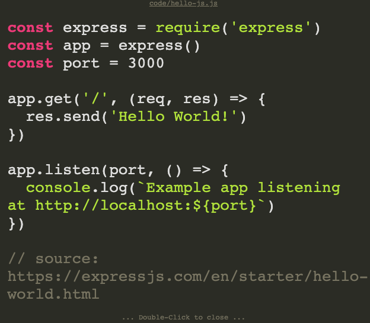

# show-code-examples

Module to view source code example source codes in a full screen modal.

- Uses [highlight.js](https://www.npmjs.com/package/highlight.js) to annotate the code.
- Detects source code language by file extension
- Caches source code downloads



## Design decisions

I created slides with reveal.js for one of my training courses.
I needed a way to:

- show code without leaving the presentation
- open examples in full screen mode
- be able to download the source of the files
- call from the source with a minimal overhead

My final approach looked like this:

```md
- [Examples](./examples/1/hello.sh){onclick="codeExamples.open(event, this)"} {.examples}
```

My initial solution added Javascript code with a simpler module in a `<script>` to the markdown source file.

At first I only needed to use it in one presentation, but I plan on using it in more presentations later on. That's why I extracted this logic.

## Getting started

```bash
# open the example
npm install
npm run example
open localhost:8080/example
```

## How to use

- Reference a `highlight.js` theme in your page e.g:

  ```html
  <link rel="stylesheet" href="highlight.js/styles/monokai.css" />
  ```

- Load the code in your page

  ```html
  <script src="/dist/show-code-examples.min.js" type="text/javascript"></script>
  ```

- Optional: Set the parent container for the modal: `codeExamples.initialize("my-examples-modal")`
- Create a link to load up the modal. This boilderplate is necessary: `codeExamples.open(event, this)`

  ```html
  <a
    href="code/hello-bash.sh"
    target="_blank"
    rel="noopener noreferrer"
    onclick="codeExamples.open(event, this)"
  >
    Bash code example
  </a>
  ```

## Documentation

### codeExamples.initialization(id)

Set a global variable of where to attach the next code viewer modal.

If you don't set a value it will treat as if it's a self managed full screen viewer.
`.sce-noscroll` will be added to the body element, in order to prevent scrolling while the overlay is active.

Otherwise I assume that you don't want fullscreen view, so `.sce-embedded` class will be
added to the children of the given container. Some classes are overridden, to work properly.

### codeExamples.open(event, this)

Must be added to an `anchor` tag. It loads the examle file from its `href` location.
It does not open or download the file when the link has been clicked.

## How it works

The component is written in [React](https://reactjs.org/).
It's rendered by `ReactDOMRenderer`.
It's built by [webpack](https://webpack.js.org/).

There are 2 distinguishable modes:

- **Full page view**: Upon opening it creates a DOM node as the last child of the `body`, and renders the react component into it.
  After it's added it won't be destroyed by the component. A state manages whether it needs to open or not.
  It will be reused on consequent clicks.
- **Custom layout**: Same as above with the difference that it will render the component into the given node.
  I made an assumption that if you want to manage the node by yourself it won't be full layout view, some classes has overrides,
  you can customize the layout behaviours with your custom css.

## Development

1. Clone the repo
1. Run `npm install`
1. Run `npm run build`
1. Run the example `npm run example`

See [index.html](/docs/index.html) for a full example.
